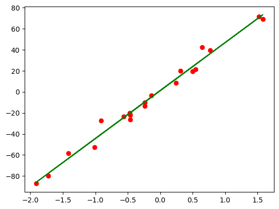

```python
from sklearn.linear_model import LinearRegression
from sklearn.datasets import make_regression
from sklearn.model_selection import train_test_split
import matplotlib.pyplot as plt
```


```python
X, y = make_regression(n_samples=20, n_features=1, noise=5, random_state=42)
X_train, X_test, y_train, y_test = train_test_split(X, y, random_state=42)
```


```python
model = LinearRegression()
model.fit(X,y)
predictons = model.predict(X)
```


```python
plt.scatter(X,y,c="red")
plt.plot(X,predictons,"g-",label="Linear Regression curve")
plt.show()
```


    

    

